# 👥 회원 API

---

<details>
<summary>🎫 회원 가입</summary>

### Request

```json
POST /api/members/register HTTP/1.1
Content-Type: application/json
host: localhost:8080

{
    "email": "admin@email.com",
    "password": "password"
}
```

### Response

```json
HTTP/1.1 201 Created
Content-Type: application/json

{
    "token": ""
}
```
    
</details>
<details>
<summary>🔑 로그인</summary>

### Request

```json
POST /api/members/login HTTP/1.1
Content-Type: application/json
host: localhost:8080

{
    "email": "abc@gmail.com",
    "password": "123qwe"
}
```

### Response

```json
HTTP/1.1 200 OK
Content-Type: application/json

{
    "token": ""
}
```

</details>

# 📦 상품 API

---

<details>
<summary>🔎 상품 조회 (전체 상품)</summary>

### Request

```json
GET /api/products HTTP/1.1
```

### Response

```json
HTTP/1.1 200 OK
Content-Type: application/json

[
    {
        "id": 1,
        "name": "아이스 카페 아메리카노 T",
        "price": 4500,
        "imageUrl": "https://st.kakaocdn.net/product/api/product/20231010111814_9a667f9eccc943648797925498bdd8a3.jpg"
    },
    {
        "id": 2,
        "name": "(ICE)아메리카노",
        "price": 2000,
        "imageUrl": "https://img1.kakaocdn.net/thumb/C320x320@2x.fwebp.q82/?fname=https%3A%2F%2Fst.kakaocdn.net%2Fproduct%2Fgift%2Fproduct%2F20220622112804_d176787353ab48c690936557eefad11c.jpg"
    }
]
```

</details>
<details>
<summary>🔎 상품 조회 (특정 상품)</summary>

### Request

```json
GET /api/products/{productId} HTTP/1.1
```

### Response

```json
HTTP/1.1 200 OK
Content-Type: application/json

{
    "id": 1,
    "name": "아이스 카페 아메리카노 T",
    "price": 4500,
    "imageUrl": "https://st.kakaocdn.net/product/api/product/20231010111814_9a667f9eccc943648797925498bdd8a3.jpg"
}
```

</details>
<details>
<summary>➕ 상품 추가</summary>

### Request

```json
POST /api/products HTTP/1.1
Content-Type: application/json

{
    "name": "(ICE)아메리카노",
    "price": 2000,
    "imageUrl": "https://img1.kakaocdn.net/thumb/C320x320@2x.fwebp.q82/?fname=https%3A%2F%2Fst.kakaocdn.net%2Fproduct%2Fgift%2Fproduct%2F20220622112804_d176787353ab48c690936557eefad11c.jpg"
}
```

### Response

```json
HTTP/1.1 201 Created
Content-Type: application/json

{
    "id": 1,
    "name": "(ICE)아케리카노",
    "price": 2000,
    "imageUrl": "https://img1.kakaocdn.net/thumb/C320x320@2x.fwebp.q82/?fname=https%3A%2F%2Fst.kakaocdn.net%2Fproduct%2Fgift%2Fproduct%2F20220622112804_d176787353ab48c690936557eefad11c.jpg"
}
```

</details>
<details>
<summary>✏️ 상품 수정</summary>

### Request

```json
PUT /api/products/{productId} HTTP/1.1
Content-Type: application/json

{
    "name": "[EVENT](ICE)아메리카노",
    "price": 1600,
    "imageUrl": "https://img1.kakaocdn.net/thumb/C320x320@2x.fwebp.q82/?fname=https%3A%2F%2Fst.kakaocdn.net%2Fproduct%2Fgift%2Fproduct%2F20250515110714_9664acdff2b84e4e806c4d7d55dd8de0.jpg"
}
```

### Response

```json
HTTP/1.1 200 OK
Content-Type: application/json

{
    "id": 1,
    "name": "[EVENT](ICE)아메리카노",
    "price": 1600,
    "imageUrl": "https://img1.kakaocdn.net/thumb/C320x320@2x.fwebp.q82/?fname=https%3A%2F%2Fst.kakaocdn.net%2Fproduct%2Fgift%2Fproduct%2F20250515110714_9664acdff2b84e4e806c4d7d55dd8de0.jpg"
}
```

</details>
<details>
<summary>❌ 상품 삭제</summary>

### Request

```json
DELETE /api/products/{productId} HTTP/1.1
```

### Response

```json
HTTP/1.1 204 No Content
```

</details>

# 🔘 옵션 API

---

<details>
<summary>🔎 옵션 조회</summary>

### Request

```json
GET /api/products/{productId}/options HTTP/1.1
```

### Response

```json
HTTP/1.1 200 OK
Content-Type: application/json

[
    {
        "id": 1,
        "name": "기본 옵션",
        "quantity": 1
    },
    {
        "id": 2,
        "name": "옵션 2",
        "quantity": 2
    }
]
```

</details>
<details>
<summary>➕ 옵션 추가</summary>

### Request

```json
POST /api/products/{productId}/options HTTP/1.1
Content-Type: application/json

{
    "name": "옵션 1",
    "quantity": 1
}
```

### Response

```json
HTTP/1.1 201 Created
Content-Type: application/json

{
    "id": 1,
    "name": "옵션 1",
    "quantity": 1
}
```

</details>
<details>
<summary>✏️ 옵션 수정</summary>

### Request

```json
PUT /api/products/{productId}/options/{optionId} HTTP/1.1
Content-Type: application/json

{
    "name": "수정된 옵션",
    "quantity": 3
}
```

### Response

```json
HTTP/1.1 200 OK
Content-Type: application/json

{
    "id": 1,
    "name": "수정된 옵션",
    "quantity": 3
}
```

</details>
<details>
<summary>❌ 옵션 삭제</summary>

### Request

```json
DELETE /api/products/{productId}/options/{optionId} HTTP/1.1
```

### Response

```json
HTTP/1.1 204 No Content
```

</details>

# 🎁 위시 리스트 API

---

<details>
<summary>🔎 위시 리스트 보기</summary>

### Request
- Header: Authorization: Bearer {JWT}

```json
GET /api/wishes?page=0&size=5&sort=createdDate,desc HTTP/1.1
Host: localhost:8080
```

### Response

```json
HTTP/1.1 200 OK
Content-Type: application/json

[
    {
        "id": 1,
        "product": {
            "id": 10,
            "name": "테스트 상품 1",
            "price": 15000,
            "imageUrl": "http://example.com/image.jpg"
        }
    },
    {
        "id": 2,
        "product": {
            "id": 12,
            "name": "테스트 상품 2",
            "price": 20000,
            "imageUrl": "http://example.com/image2.jpg"
        }
    }
]
```
    
</details>
<details>
<summary>➕ 위시 리스트 추가</summary>

### Request
- Header: Authorization: Bearer {JWT}

```json
POST /api/wishes HTTP/1.1
Content-Type: application/json
host: localhost:8080

{
    "productId": 1
}
```

### Response

```json
{
    "id": 1,
    "product": {
        "id": 10,
        "name": "테스트 상품 1",
        "price": 15000,
        "imageUrl": "[http://example.com/image.jpg](http://example.com/image.jpg)"
    }
}
```
    
</details>
<details>
<summary>❌ 위시 삭제</summary>

### Request
- Header: Authorization: Bearer {JWT}

```json
DELETE /api/wishes/{wishId} HTTP/1.1
host: localhost:8080

```

### Response

```json
HTTP/1.1 204 No Content
```
    
</details>

# 👤 유저 화면

---

<details>
<summary>✅ 로그인 및 회원가입</summary>

### 로그인

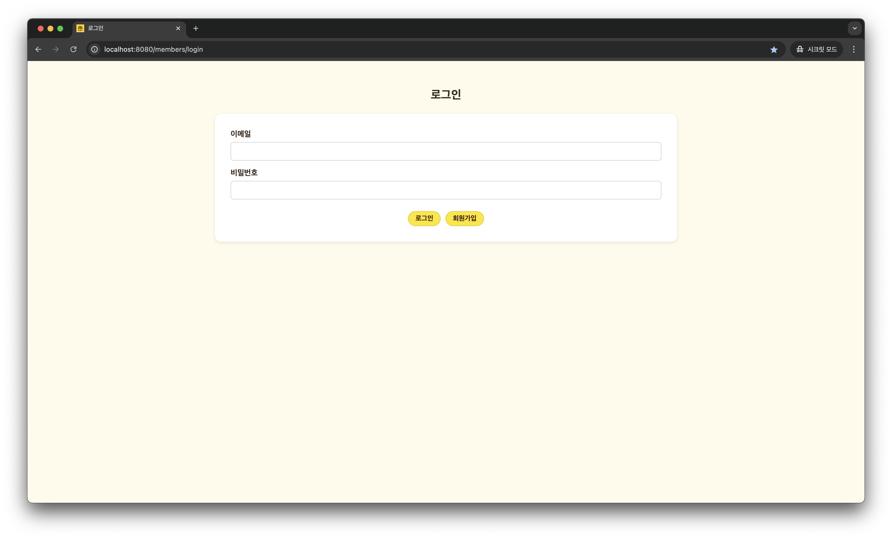

[GET] http://localhost:8080/members/login  
→ 로그인 화면으로 이동합니다.

### 회원가입

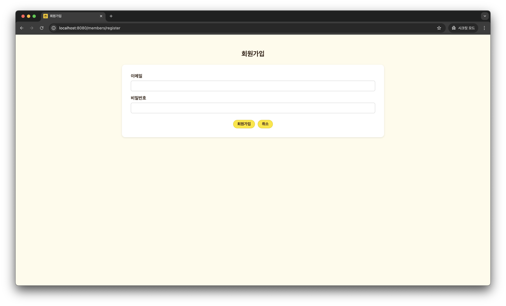

[GET] http://localhost:8080/members/register  
→ 회원가입 화면으로 이동합니다.
</details>
<details>
<summary>🔎 상품 조회</summary>

### 전체 상품 목록

<table>
    <tr>
        <td style="text-align: center">
            <div>오래된순</div>
        </td>
    </tr>
    <tr>
        <td>
            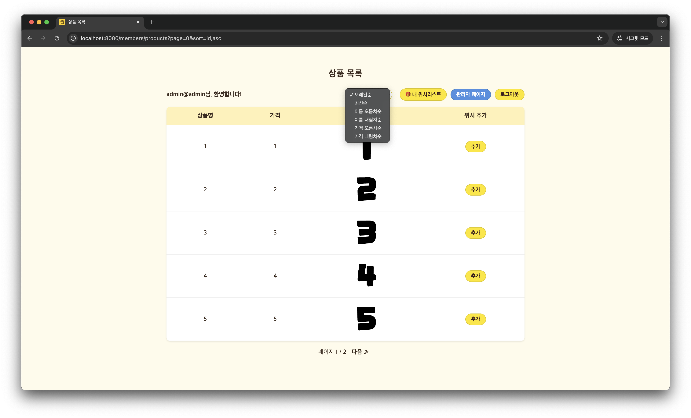
            <br>
            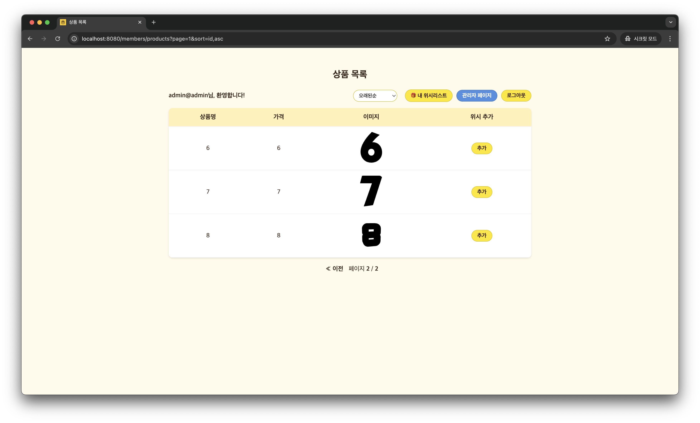
        </td>
    </tr>
    <tr>
        <td style="text-align: center">
            <div>가격 내림차순</div>
        </td>
    </tr>
    <tr>
        <td>
            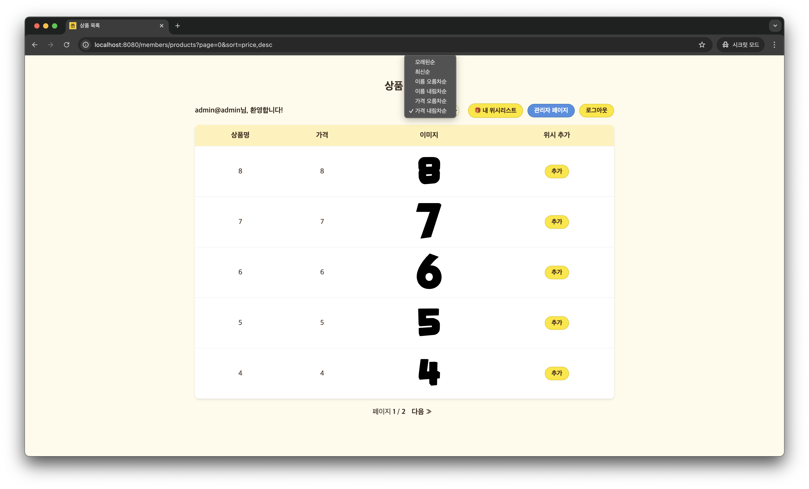
            <br>
            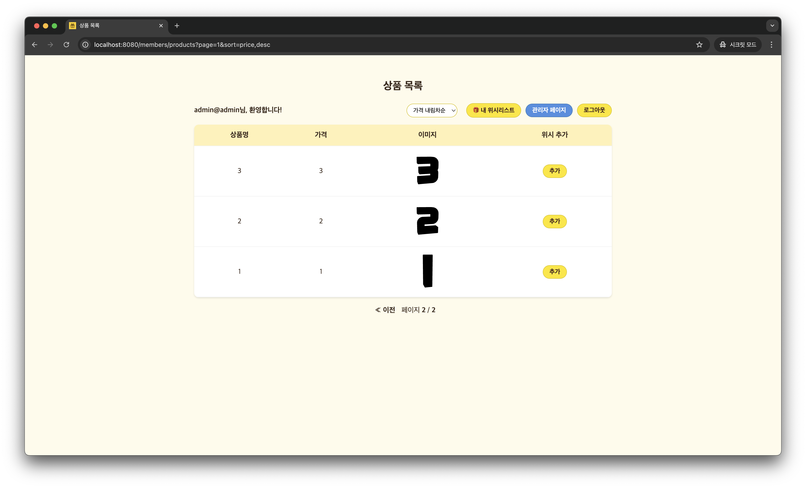
        </td>
    </tr>
</table>

[GET] http://localhost:8080/members/products  
→ 등록된 모든 상품을 목록으로 확인할 수 있는 화면입니다.

### 특정 상품 조회

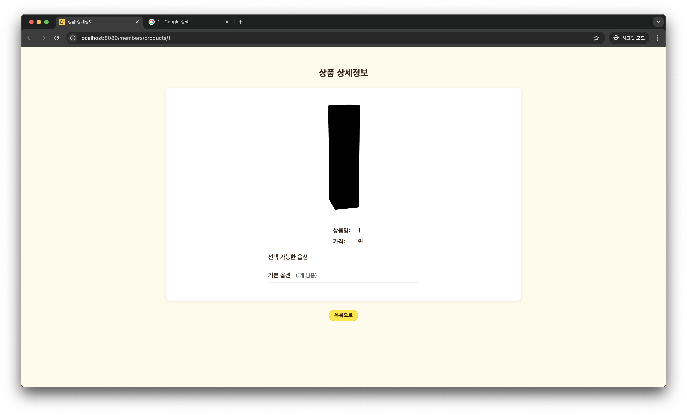

[GET] http://localhost:8080/members/products/{productId}  
→ 선택한 상품의 상세 정보를 확인할 수 있는 화면입니다.
</details>
<details>
<summary>🔎 위시 리스트 조회</summary>

### 위시 리스트 조회

<table>
    <tr>
        <td style="text-align: center">
            <div>최신순</div>
        </td>
    </tr>
    <tr>
        <td>
            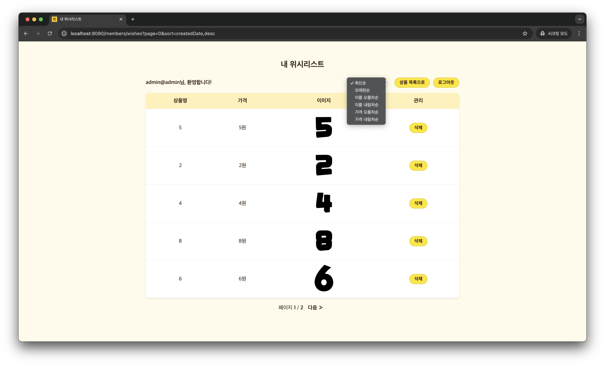
            <br>
            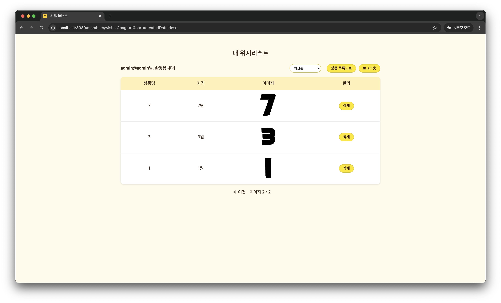
        </td>
    </tr>
    <tr>
        <td style="text-align: center">
            <div>가격 오름차순</div>
        </td>
    </tr>
    <tr>
        <td>
            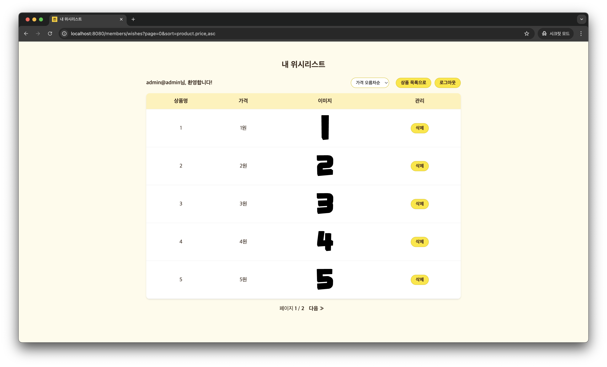
            <br>
            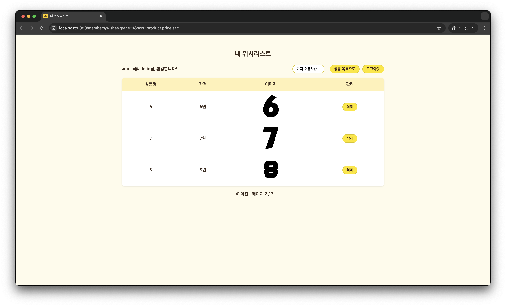
        </td>
    </tr>
</table>

[GET] http://localhost:8080/members/wishes  
→ 선택한 상품의 상세 정보를 확인할 수 있는 화면입니다.
</details>
<details>
<summary>❌ 위시 삭제</summary>

[DELETE] http://localhost:8080/members/wishes/{wishId}  
→ HTML `<form>`에서 `_method=delete`로 전송됩니다.  
→ 실제 HTTP 메서드는 `POST`이며,  
→ MemberFrontController에서 `@DeleteMapping`으로 처리합니다.
</details>

# 🧑‍💻 관리자 화면

---

<details>
<summary>🔎 상품 조회</summary>

### 전체 상품 목록

[GET] http://localhost:8080/admin/products  
→ 등록된 모든 상품을 목록으로 확인할 수 있는 화면입니다.

### 특정 상품 조회

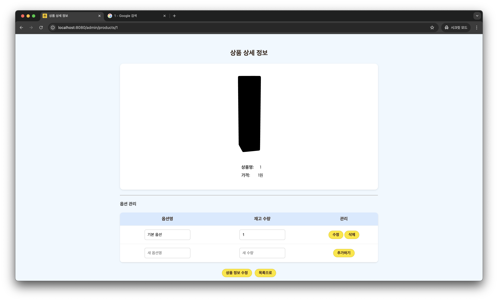

[GET] http://localhost:8080/admin/products/{productId}  
→ 선택한 상품의 상세 정보를 확인 및 옵션 수정을 할 수 있는 화면입니다.
</details>
<details>
<summary>➕ 상품 추가</summary>

### 상품 추가 화면

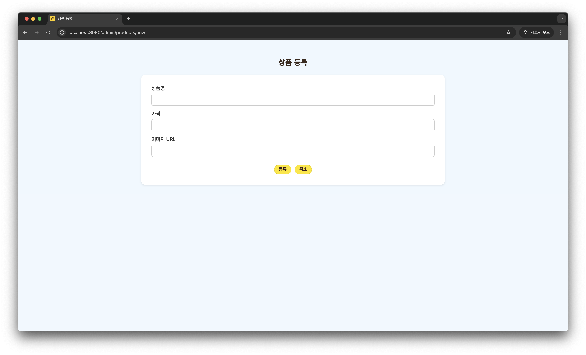

[GET] http://localhost:8080/admin/products/new  
→ 새 상품을 입력하는 폼으로 이동합니다.

### 상품 추가 요청

[POST] http://localhost:8080/admin/products  
→ 폼에서 입력된 내용을 서버에 전송해 새 상품을 추가합니다.
</details>
<details>
<summary>✏️ 상품 수정</summary>

### 상품 수정 화면

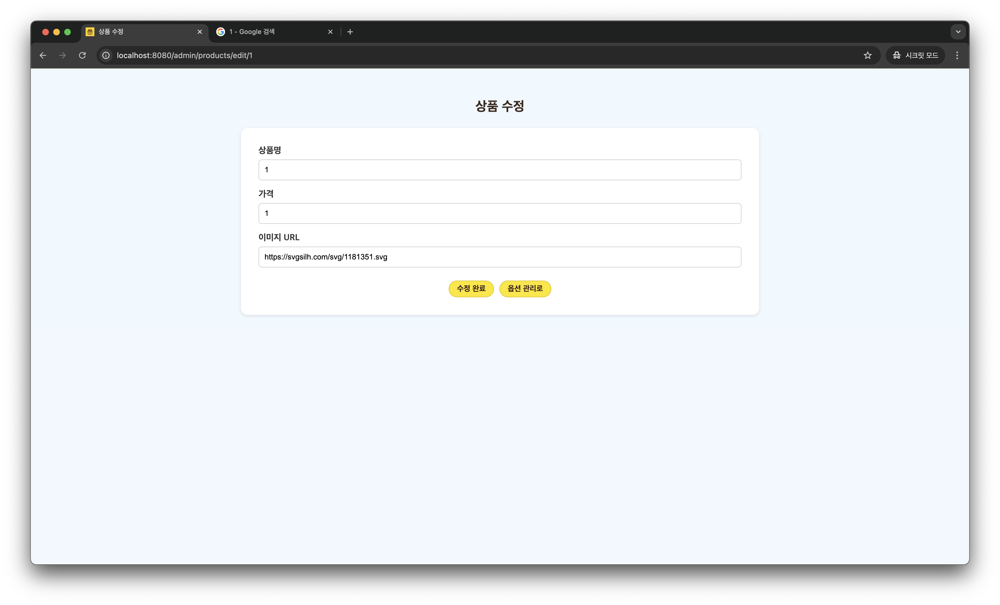

[GET] http://localhost:8080/admin/products/edit/{productId}  
→ 선택한 상품의 정보를 수정할 수 있는 화면입니다.

### 상품 수정 요청

[PUT] http://localhost:8080/admin/products/{productId}  
→ HTML `<form>`에서 `_method=put`로 전송되는 요청입니다.  
→ 실제 HTTP 메서드는 `POST`이며,  
→ AdminController에서 `@PutMapping`으로 처리합니다.
</details>
<details>
<summary>❌ 상품 삭제</summary>

### 상품 삭제 요청

[DELETE] http://localhost:8080/admin/products/{productId}  
→ HTML `<form>`에서 `_method=delete`로 전송됩니다.  
→ 실제 HTTP 메서드는 `POST`이며,  
→ AdminController에서 `@DeleteMapping`으로 처리합니다.
</details>

# 💾 데이터베이스

---

<details>
<summary>🛠️ 사용 DB</summary>

### H2 Database (인메모리 DB)

- JDBC URL: `jdbc:h2:mem:spring-gift`
- Username: `sa`
- Password: ``

</details>
<details>
<summary>📌 DB 초기화</summary>

```sql
drop table if exists member
drop table if exists option
drop table if exists product
drop table if exists wish

create table member (
    id bigint not null auto_increment,
    email varchar(255) not null,
    password varchar(255) not null,
    role enum ('ADMIN','USER') not null,
    primary key (id)
)

create table option (
        quantity integer not null,
        id bigint not null auto_increment,
        product_id bigint not null,
        name varchar(50) not null,
        primary key (id)
)

create table product (
    id bigint not null auto_increment,
    price bigint not null,
    image_url varchar(255) not null,
    name varchar(255) not null,
    primary key (id)
)

create table wish (
    created_date datetime(6) not null,
    id bigint not null auto_increment,
    member_id bigint not null,
    product_id bigint not null,
    primary key (id)
)

alter table member 
   add constraint UKmbmcqelty0fbrvxp1q58dn57t unique (email)

alter table option 
       add constraint UKe78vjnqbmknqwm7d6k2blhhnj unique (product_id, name)

alter table wish 
   add constraint UKimrh37c61jscdegh9fi3jbpix unique (member_id, product_id)

alter table option 
       add constraint FK5t6etuqa4wl7lyn0ysxnts7q4 
       foreign key (product_id) 
       references product (id)

alter table wish 
   add constraint FK70nrc4a6uvljrtemsn80eq1gd 
   foreign key (member_id) 
   references member (id)
       
alter table wish 
   add constraint FKh3bvkvkslnehbxqma1x2eynqb 
   foreign key (product_id) 
   references product (id)
```

</details>

# ⚖️ 유효성 검사 및 예외 처리

---

<details>
<summary>🔍 유효성 검사</summary>

## 멤버
### `이메일`
- 필수 입력
- 이메일 형식

### `비밀번호`
- 필수 입력

## 상품
### `상품 이름`
- 필수 입력
- 최소 1자, 최대 15자
- (), [], +, -, &, /, _ 외의 특수 문자를 사용할 수 없음
- RequiresApprovalWords 어노테이션을 사용하여 특정 단어가 포함되지 않도록 검사

### `상품 가격`
- 0원 이상

### `상품 이미지 URL`
- 필수 입력

## 옵션
### `옵션 이름`
- 필수 입력
- 최소 1자, 최대 50자
- (), [], +, -, &, /, _ 외의 특수 문자를 사용할 수 없음
- 중복된 옵션 이름은 허용하지 않음 (같은 상품 내에서)

### `옵션 수량`
- 필수 입력
- 1개 이상 1억 개 미만
</details>
<details>
<summary>🚨 예외 처리</summary>

### EntityNotFoundException `404 Not Found`
- MemberNotFoundException
  - 멤버가 존재하지 않을 경우 (조회 시)
- ProductNotFoundException
  - 상품이 존재하지 않을 경우 (조회, 수정, 삭제 시)
- WishNotFoundException
  - 위시가 존재하지 않을 경우 (삭제 시)
- OptionNotFoundException
  - 옵션이 존재하지 않을 경우 (수정, 삭제 시)

### DataConflictException `409 Conflict`
- EmailDuplicateException
  - 중복된 이메일로 회원가입 할 때
- WishDuplicateException
  - 중복된 위시를 추가할 때
- OptionNameDuplicateException
  - 옵션 이름이 중복될 때 (같은 상품 내에서)
- InvalidOptionQuantityException
  - 옵션 수량이 1개 이상 1억 개 미만이 아닐 때

### AuthenticationException `401 Unauthorized`
- 인증되지 않은 사용자 (로그인하지 않은 경우)
- 인증 토큰이 유효하지 않은 경우 (예: 만료된 토큰)
- LoginFailedException
  - 로그인 실패 시 (잘못된 이메일 또는 비밀번호)

### AuthorizationException `403 Forbidden`
- 인증된 사용자 (로그인한 경우) 권한이 없는 요청
  - 일반 사용자가 관리자 권한이 필요한 행위 요청

### MethodArgumentNotValidException `400 Bad Request`
- 상품을 생성할 때 제약조건에 맞지 않을 경우

### InvalidOptionAccessException `400 Bad Request`
- 해당 상품에 속한 옵션이 아닐 때 수정 및 삭제하는 경우

### OptionPolicyException `409 Conflict`
- 옵션이 1개 뿐인 상품의 옵션을 삭제하는 경우

</details>

# 🧪 테스트

---

<details>
<summary>E2E 테스트</summary>

- AuthE2ETest
  - 관리자/일반 사용자 로그인, 페이지 접근 권한 등 인증/인가 테스트
- PaginationE2ETest
  - 관리자/사용자 상품 목록, 위시리스트의 페이지네이션 및 정렬 기능 테스트
</details>
<details>
<summary>Domain 테스트</summary>

- OptionTest
  - 옵션 삭제 테스트
</details>
<details>
<summary>Repository 테스트</summary>

- MemberRepositoryTest
  - 회원 정보 저장 및 이메일 중복 조회
- ProductRepositoryTest
  - 상품 CRUD 기능 테스트
- WishRepositoryTest
  - 위시리스트 저장, 조회 및 중복 저장 방지 테스트
</details>
<details>
<summary>Service 테스트</summary>

- MemberServiceTest
  - 회원가입, 로그인 성공/실패(이메일 중복, 비밀번호 불일치) 케이스 테스트
- ProductServiceTest
  - 상품 생성, 조회, 수정, 삭제 기능 테스트
- WishServiceTest
  - 위시리스트 추가, 삭제 및 예외(중복, 권한 없음) 처리 테스트
</details>